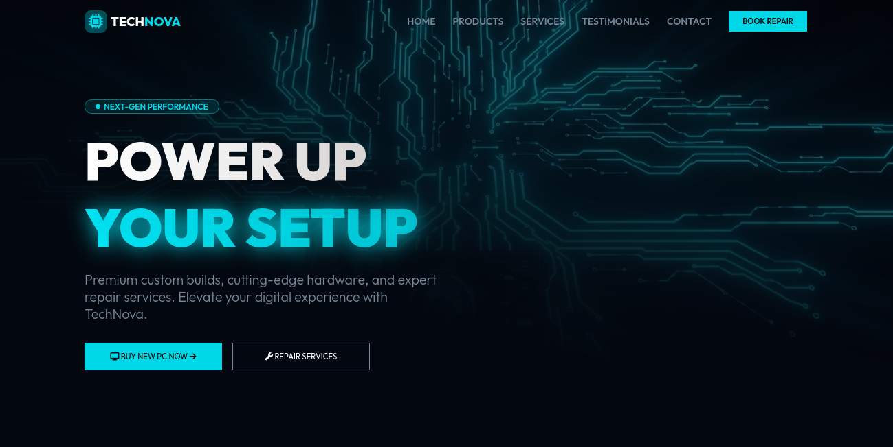

<p align="center">
  
</p>

<h1 align="center">TechNova</h1>

<p align="center">
  <strong>Landing page moderna</strong> • Design futurista • HTML + CSS + JavaScript puro
</p>

<p align="center">
  <a href="https://joeln356.github.io/TechNova/"><strong>Ver demonstração ao vivo →</strong></a>
  <br><br>
  
  
  
  
</p>

---

### ✨ Sobre o TechNova

**TechNova** é uma landing page clean e moderna criada para apresentar **ideias inovadoras**, startups de tecnologia, portfólios pessoais ou produtos digitais com visual futurista/neon.

Características principais:
- Design responsivo (mobile-first)
- Animações suaves com CSS puro
- Efeitos de hover e scroll modernos
- Carregamento rápido (sem frameworks pesados)

---

### 🌐 Demonstração

**[Acesse o site ao vivo aqui](https://joeln356.github.io/TechNova/)**

---

### 🛠️ Tecnologias utilizadas

- HTML5
- CSS3
- JavaScript
- Hospedagem: **GitHub Pages**

---

### 🚀 Como rodar localmente

1. Clone o repositório
   ```bash
   git clone https://github.com/joeln356/TechNova.git
